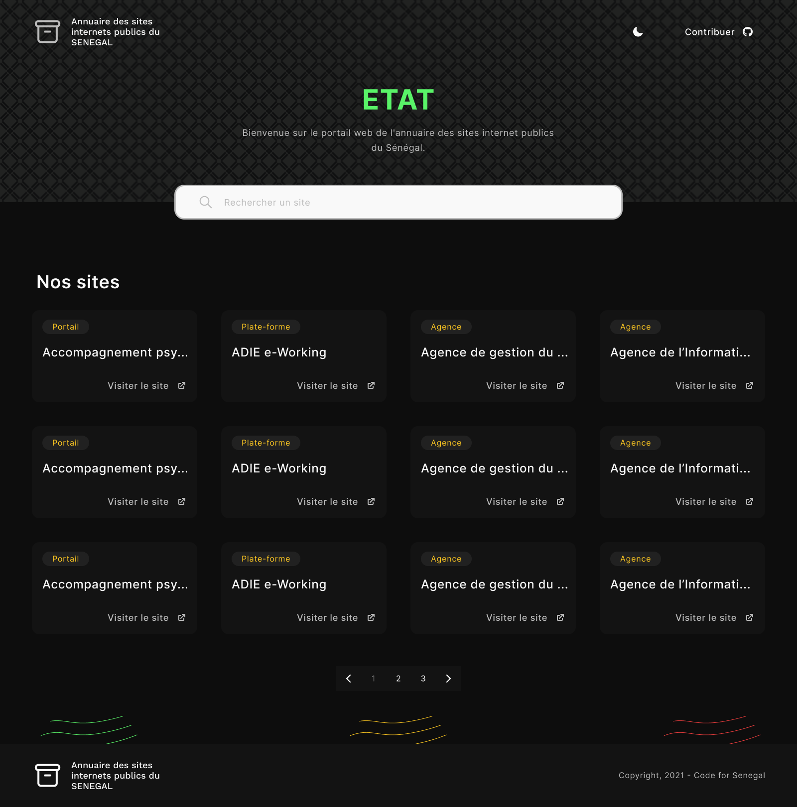
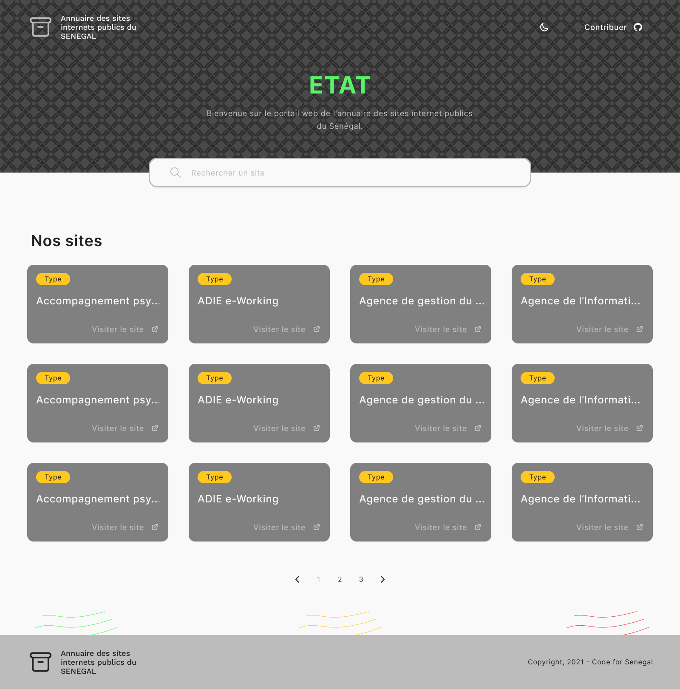

# Etat

[](https://github.com/Code-for-Senegal/etat/graphs/contributors) [](https://github.com/Code-for-Senegal/etat/commits/master) [](https://opensource.org/licenses/MIT)

Bienvenue, le projet **Etat** vise la réalisation d'un portail web de l'annuaire des sites internet publics du Sénégal, vous trouverez les informations nécessaires pour apporter votre contribution si dessous.

[Contribution](#contribution) | [Platforme](#platforme) | [Données](#données) | [Déploiement](#déploiement) | [Langages de programmation](#langages-de-programmation) | [License](#license) | [À propos de Code for Senegal](#à-propos-de-code-for-senegal)

## Contribution

Ce projet est construit par d'incroyables bénévoles et vous pouvez en faire partie! Voici [comment vous pouvez contribuer à ce projet](https://github.com/Code-for-Senegal/.github/blob/main/CONTRIBUTING.md). Si vous souhaitez apporter des modifications à ce dépôt, veuillez **d'abord faire un fork**.

Aidez-nous en testant ce projet. Si vous voyez quelque chose qui ne fonctionne pas tout à fait comme prévu, ouvrez un [issue](https://github.com/Code-for-Senegal/etat/issues). Assurez-vous de décrire en détail ce à quoi vous vous attendez et ce qui se passe réellement.

Si vous souhaitez suggérer une nouvelle fonctionnalité, ouvrez un [issue](https://github.com/Code-for-Senegal/etat/issues) et marquez-le comme __[Demande de fonctionnalité]__. Veuillez préciser pourquoi vous pensez que cette fonctionnalité sera utile. Si vous le pouvez, veuillez inclure une description visuelle de ce à quoi vous aimeriez que l'interface utilisateur ressemble, si vous suggérez de nouveaux éléments d'interface utilisateur.

### Platforme

* Web

### Données

* [Annuaire Sites Publics Senegal](https://github.com/senegalouvert/annuaire-sites-publics-senegal)

## Bien Débuté

Tout d'abord, exécutez le serveur de développement:

```bash
git clone https://github.com/Code-for-Senegal/etat.git
cd etat
npm install
npm run dev
```

Ouvrir [http://localhost:3000](http://localhost:3000) avec votre navigateur pour voir le résultat.

## Apprendre d'avantage sur Next.js

Pour en savoir plus sur Next.js, consultez les ressources suivantes:

* [Documentation Next.js](https://nextjs.org/docs) - en savoir plus sur les fonctionnalités et l'API de Next.js.
* [Apprenez Next.js](https://nextjs.org/learn) - un didacticiel interactif Next.js.

Vous pouvez consulter [le dépôt Next.js GitHub](https://github.com/vercel/next.js/) - vos commentaires et contributions sont les bienvenus!

## Générer votre CSS

vous pouvez utiliser l'outil CLI Tailwind pour générer votre CSS

```bash
npm run tailwindcss
```

## Apprendre d'avantage sur Tailwindcss

Pour en savoir plus sur Tailwindcss, consultez les ressources suivantes:

* [Documentation Tailwindcss](https://tailwindcss.com/docs)

## Maquette du site
Version 'Dark'             |  Version 'Light'
:-------------------------:|:-------------------------:
[](design/README.md)  |  [](design/README.md)

## Déploiement

Nous privilégions ces services gratuits.

* [Netlify](https://www.netlify.com)
* [Github Pages](https://pages.github.com)
* [Heroku](https://www.heroku.com)

### Langages de programmation

* Libre à vous de choisir

## License

Ce projet est sous licence MIT - voir le fichier [LICENSE](LICENSE) pour plus de détails.

## À propos de Code for Senegal

Nous sommes une communauté de bénévoles (développeurs, ux / ui, communications, data scientists, graphistes, devops, sécurité informatique et plus) qui travaillent bénévolement pour développer des solutions digitales pour résoudre des problèmes sociaux. #techforsocialgood. Si vous souhaitez en savoir plus sur nos projets [visitez kaaaycoder](https://github.com/Code-for-Senegal/kaaycoder).
