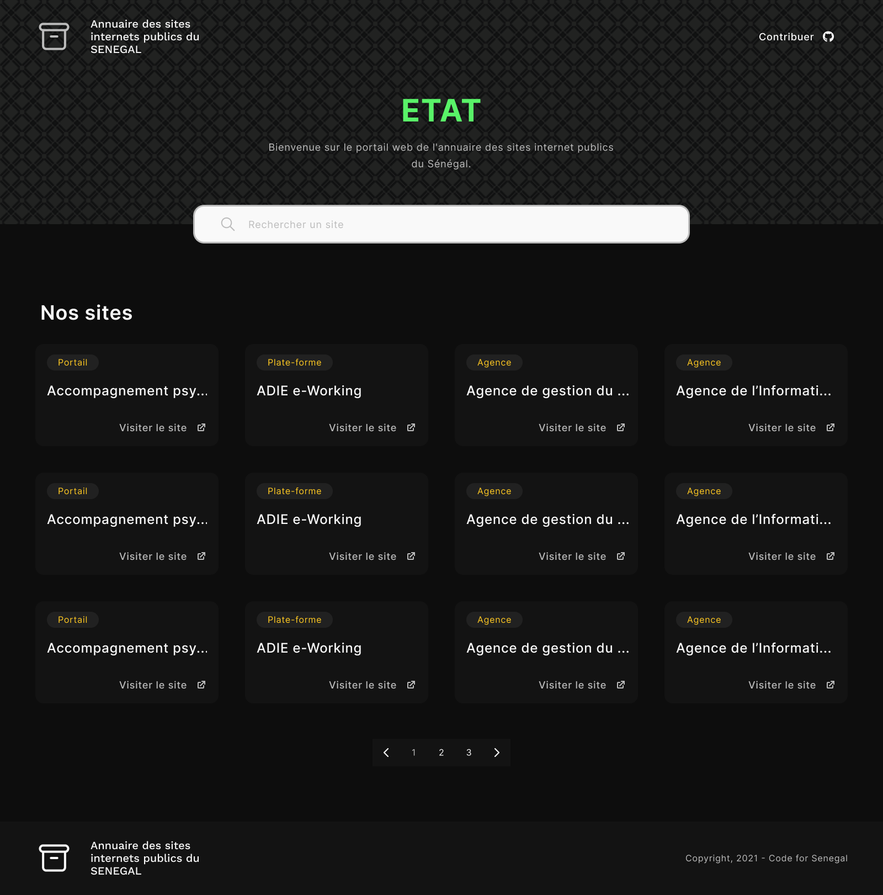

# Maquette du site

Cette maquette a été réalisée avec Figma. Pour ouvrir le fichier, cliquer [ici](https://www.figma.com/file/wBZoRQ0q8Nl7pIHrFfp1Rz/ETAT?node-id=31%3A47).

## Table of contents

- [Le 'Design System' du site](#le-'design-system'-du-site)
  - [La palette de couleur](#la-palette-de-couleur)
  - [La typographie](#la-typographie)
  - [Les composants](#les-composants)
- [Partie codage](#partie-codage)

## Le 'Design System' du site

Cette section va permettre aux développeurs front de mieux comprendre la structure des éléments de la maquette.

### La palette de couleur

[section à remplir]

### La typographie

[section à remplir]

### Les composants

[section à remplir]

## Partie codage

Pour la partie codage, nous pouvons soit utiliser des framework CSS comme [TailwindCSS](https://www.tailwindcss.com) ou bien créer nos propres feuilles de styles avec CSS(ou bien Sass).
